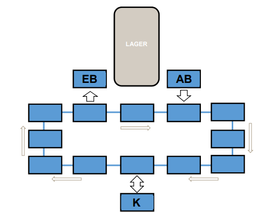

# BasicLogisticLoop
Dieses Projekt ist entstanden als Aufgabe zur Feststellung meiner Fähigkeiten in Anstellung als Werkstudent.  
Als Programmiersprache zu benutzen war C#, empfohlen wurde WindowsForms als Grafische Benutzeroberfläche.  
Ich hatte vorher nur sehr wenig C#-Erfahrung und habe im Verlauf dieses Projekts viel dazu gelernt.

## Aufgabenstellung
### Beschreibung
Das Projekt der Aufgabe stellt in stark vereinfachter Form den Materialfluss auf einer Fördertechnik in einem 
Lager dar. Die Fördertechnik hat das Folgende Layout:  

### Vorgaben
- Behälter werden über eine Auslagerbahn (<b>AB</b>) ausgelagert. 
- Behälter werden über eine Einlagerbahn (<b>EB</b>) eingelagert. 
- Ausgelagerte Behälter sollen an einem Kommissionierplatz (<b>K</b>) kommissioniert werden. 
- Die möglichen Materialflüsse (uni- bzw. bidirektional) werden über die Pfeile abgebildet. 
- Jedes Rechteck symbolisiert einen Platz auf dem maximal ein Behälter stehen kann. 
- Der Vorgabeweg eines Behälters ist immer  <b>AB</b> -> <b>K</b> -> <b>EB</b> -> nicht in der aktuellen Materialverfolgung (steht im Lager) 
- Behälter werden auf der AB in die Materialverfolgung aufgenommen. 
- Behälter werden bei Weitertaktung auf der EB aus der Materialverfolgung genommen (steht im Lager). 
- Auf der Fördertechnik können n Behälter unterwegs sein. 
- Für Behälter sollen folgende Eigenschaften mitgeführt werden: 
	- Eindeutige Behälternummer (TransportUnit-Nummer) 
	- enthaltener Artikel (Bezeichnung) 
- Die Eigenschaften werden beim „Erzeugen“ des Behälters (Erscheinen auf der <b>AB</b>) manuell eingegeben. 

### Funktionen
- Auslagern 
	- Auf Buttonclick soll auf dem <b>AB</b>-Platz, sofern frei, ein Behälter „gebucht“ werden, dessen Ziel es ist an den Kommissionierplatz (<b>K</b>) zu fahren. 
- Weiter takten 
	- Alle im System befindlichen Behälter werden auf den jeweils nächst möglichen Platz gebucht. 
	- Hat ein Behälter das Ziel <b>K</b> und dieses ist noch belegt muss er im Loop verbleiben und darf erst eingelagert werden, wenn er am <b>K</b>-Platz war. 
- Einschleusung (Kommissionierung) 
	Auf Buttonclick gelangt ein Behälter vom <b>K</b>-Platz wieder zurück in den Loop, sein neues Ziel ist nun die <b>EB</b>. 
- Es soll zu jeder Zeit nachvollziehbar sein welcher Behälter auf Platz X steht und welche Eigenschaften er hat.

### Zusammenfassung
- AB -> Loop (über Taktung, falls Folgeplatz frei) 
- Loop -> K (über Taktung, falls K-Platz frei) 
- K -> Loop (über Einschleusung, falls Folgeplatz frei) 
- Loop -> EB (über Taktung) 
- EB -> nicht im System (über Taktung) 

### Tipps
- Die reine Funktionalität kann von der Visualisierung getrennt abgebildet werden. 
- Eine Übersicht über die Belegung kann in Form einer Tabelle, Ausgaben in einem Memo oder über eine geeignete Platzvisualisierung erfolgen.
- Zur Verwaltung der Plätze und der im System vorhandenen Behälter sowie deren Eigenschaften (Position, Ziel, Bezeichnung etc.) können verschiedene Ansätze gewählt werden, verwenden Sie geeignete Datentypen.
- Objektorientierte Lösungen sind vorzuziehen. 

## Design-Entscheidungen und Verbesserungsmöglichkeiten
- Ist nur eine Basic-Version -> Erweiterbarkeit für Ergänzungen oder Veränderungen am Modell
	- Gegen Interfaces implementiert, sodass man das Modell durch ein neues ersetzen kann
	- "View Logik" lässt sich wegen Windows Forms nicht gut ersetzen 
	-> Wie etwas angezeigt wird aus dem Modell müsste man dann im Forms auch anpassen (weitere Methoden), wobei viel schon auf allgemeinere Konzepte implementiert ist als auf spezifische Variablen und Instanzen
- MVP für Trennung zwischen Modell und Benutzerinteraktion
	- Windows Forms ist nicht wirklich für MVP geeignet und hat schon die Hauptschleife vom Programm
	-> Presenter kann nicht die tatsächliche Kontrolle haben, wird aber immer von View mit den reinen Informationen angefragt und behandelt alles vom Modell
	- Nach MVP soll das Modell nicht vom View "wissen" und View das Modell nicht direkt verändern können
	-> ViewNode structs, die Value-Typen sind also als Kopie und nicht per Referenz übergeben werden mit den wichtigen Daten aus dem Modell, die View anzeigen soll
- Form Designer nur für Prototypen benutzt, ansonsten alles im Code erzeugen
	- Wegen Erweiterbarkeit, sobald man ein leicht anderes Modell hat muss man den Designer dafür verwenden aber kann immer nur ein Modell halten
	- Namenskonventionen sind übersichtlicher, Zugriff auf bestimmte Teile des View kann über Methoden und Konstanten bestimmt werden
	- Man hätte nur Modell dynamisch erzeugen können und den Rest außenrum zu Design-Zeit, aber ich habe es gerne einheitlich
- Für Modell nur ein Lager und eine Auslagerstation, daher im View keine Darstellungsmöglichkeit für mehr als eins (Aufwand)
	- Model hat dennoch die Modellierung, mehrere dieser Nodes zu haben, falls das in einem Fall gebraucht werden würde
	- Dann muss aber der View angepasst werden.
- Für Step() wird gechecked ob eine node schon etwas getan hat aber man müsste überprüfen für jeden container, dass er sich nur einmal bewegen kann
- Sehr viele Find(), Select(), FindAll(), Queries, Aufreihung von Schleifen statt einer -> schlechte Laufzeit
